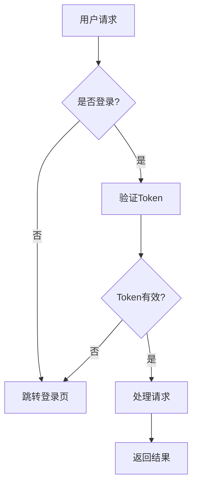
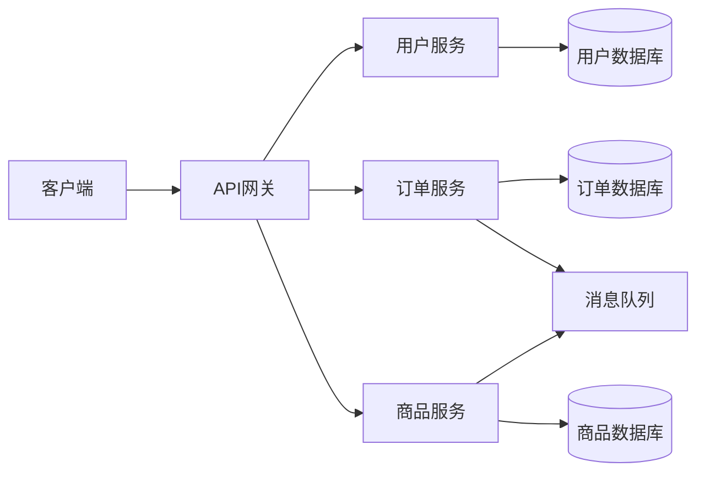
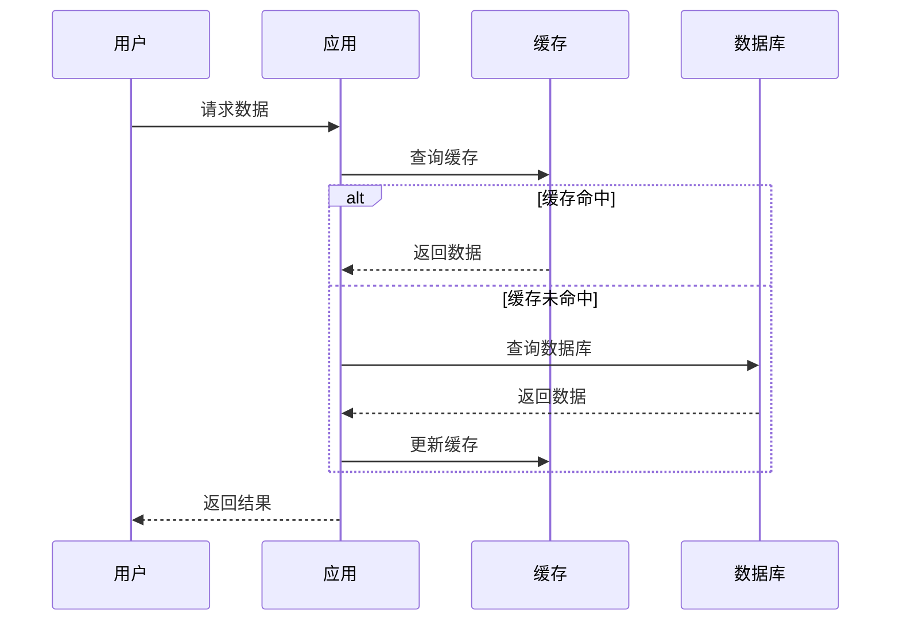
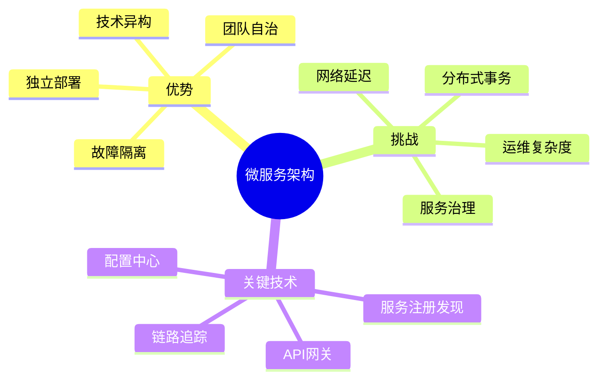

# 表达方式与沟通模式

本文档详细说明协作伙伴技能中使用的表达方式，包括渐进式沟通、结构化表达框架和可视化技巧。

## 目录

1. [渐进式沟通（三层递进）](#渐进式沟通三层递进)
2. [结构化表达框架](#结构化表达框架)
3. [可视化图表](#可视化图表)
4. [分层递进表达](#分层递进表达)

---

## 渐进式沟通（三层递进）

渐进式沟通是一种从简单到复杂、从具体到抽象的表达方式，帮助用户逐步建立深入理解。

### 第一层：类比阶段

**目的**：用生活化的比喻建立初步理解

**特点**：
- 使用日常生活中的场景
- 避免专业术语
- 建立直观感受

**示例**：
```
微服务就像餐厅的分工：
- 前台负责接待客人（API网关）
- 厨房负责做菜（业务服务）
- 收银负责结账（支付服务）
各司其职，互不干扰
```

### 第二层：概念阶段

**目的**：逐步引入专业术语和技术概念

**特点**：
- 引入行业标准术语
- 说明技术原理
- 建立专业认知

**示例**：
```
微服务架构通过服务拆分实现松耦合：
- 每个服务独立部署和扩展
- 服务间通过API通信
- 使用服务注册与发现机制
- 采用分布式事务处理
```

### 第三层：洞见阶段

**目的**：提供深层次的思想和关键发现

**特点**：
- 揭示本质规律
- 指出权衡和代价
- 提供战略性思考
- 使用 ★ Insight 标记

**示例**：
```
★ Insight: 微服务的本质是用网络复杂度换取代码复杂度。

适合场景：
- 大团队协作（>20人）
- 不同模块变化频率差异大
- 需要独立扩展不同服务

代价：
- 增加运维成本（部署、监控、日志）
- 分布式系统的挑战（网络延迟、数据一致性）
- 需要更成熟的DevOps能力
```

### 使用建议

- **简单概念**：类比 + 概念即可
- **复杂概念**：完整三层递进
- **技术细节**：可以跳过类比，直接概念 + 洞见
- **业务讨论**：重点在类比和洞见

---

## 结构化表达框架

根据不同场景选择合适的结构化框架，使表达更清晰、更有条理。

### 1. SMART框架（目标设定）

用于明确和评估目标的合理性。

**组成**：
- **S**pecific（具体）：目标是否明确具体？
- **M**easurable（可衡量）：如何衡量是否达成？
- **A**chievable（可实现）：是否现实可行？
- **R**elevant（相关）：是否与整体目标一致？
- **T**ime-bound（时限）：是否有明确时间限制？

**示例**：
```
目标：提升系统性能

SMART分析：
✗ 不够具体：什么性能？提升多少？
✓ 改进后：将API平均响应时间从500ms降低到200ms，在3个月内完成

S - 具体：API响应时间，从500ms到200ms
M - 可衡量：可以通过监控系统测量
A - 可实现：通过缓存和查询优化可以达到
R - 相关：符合提升用户体验的整体目标
T - 时限：3个月内完成
```

### 2. 5W2H框架（全面分析）

用于全面分析问题或方案的各个方面。

**组成**：
- **What**（是什么）：要做什么？核心内容是什么？
- **Why**（为什么）：为什么要做？目的和价值是什么？
- **Who**（谁）：谁来做？涉及哪些角色？
- **When**（何时）：什么时候做？时间安排如何？
- **Where**（何地）：在哪里做？适用范围是什么？
- **How**（如何做）：怎么做？具体方法是什么？
- **How much**（多少成本）：需要多少资源？成本如何？

**示例**：
```
方案：引入Redis缓存

5W2H分析：
What - 在应用层引入Redis作为缓存层
Why - 减少数据库压力，提升响应速度
Who - 后端团队负责开发，运维团队负责部署
When - 第一阶段（2周）：热点数据缓存；第二阶段（2周）：全面缓存
Where - 应用于高频查询接口（用户信息、商品列表等）
How - 使用Spring Cache + Redis，设置合理的过期时间和缓存策略
How much - 服务器成本增加约20%，开发时间4周
```

### 3. PDCA循环（持续改进）

用于描述迭代优化的过程。

**组成**：
- **P**lan（计划）：制定目标和方案
- **D**o（执行）：实施方案
- **C**heck（检查）：评估效果
- **A**ct（改进）：根据结果调整

**示例**：
```
性能优化的PDCA循环：

Plan - 计划优化数据库查询，目标响应时间<200ms
Do - 添加索引，优化SQL语句
Check - 监控显示响应时间降至250ms，未达目标
Act - 分析发现还有N+1查询问题，调整方案继续优化

→ 进入下一个PDCA循环
```

### 4. 问题-原因-方案（PCS）框架

用于问题分析和解决方案设计。

**组成**：
- **P**roblem（问题）：现象和影响
- **C**ause（原因）：根本原因分析
- **S**olution（方案）：解决方案和预期效果

**示例**：
```
Problem - 用户登录失败率高达15%
Cause -
  1. 验证码识别困难（占60%）
  2. 密码输入错误（占30%）
  3. 网络超时（占10%）
Solution -
  1. 优化验证码：使用滑块验证替代图片验证码
  2. 密码提示：增加密码强度提示和找回功能
  3. 超时处理：增加重试机制和友好提示
预期效果：失败率降至5%以下
```

---

## 可视化图表

适当使用Mermaid图表可以大大增强理解效果。

### 1. 流程图

**用途**：展示工作流程和决策路径

**示例**：


### 2. 架构图

**用途**：说明系统结构和组件关系

**示例**：


### 3. 时序图

**用途**：展示交互过程和时间顺序

**示例**：


### 4. 思维导图

**用途**：梳理概念和知识结构

**示例**：


### 使用建议

- **流程复杂时**：使用流程图
- **架构讨论时**：使用架构图
- **交互分析时**：使用时序图
- **概念梳理时**：使用思维导图
- **保持简洁**：图表不要过于复杂，必要时拆分多个图

---

## 分层递进表达

从宏观到微观、从整体到细节的表达方式。

### 三层结构

**第一层：总体结论**
- 给出核心观点
- 说明整体方向
- 提供宏观视图

**第二层：分项说明**
- 拆解关键要素
- 说明各部分关系
- 提供中观视图

**第三层：具体细节**
- 深入实现细节
- 提供代码示例
- 提供微观视图

### 示例：架构设计表达

**第一层 - 总体结论**：
```
🎯 建议采用"单体优先，按需拆分"的渐进式架构策略

核心理念：
- 从简单开始，根据实际需求演进
- 避免过早优化和过度设计
- 保持架构的灵活性和可演进性
```

**第二层 - 分项说明**：
```
📊 架构演进路径：

阶段1：单体应用（0-6个月）
- 快速开发和部署
- 简单的运维管理
- 适合MVP和早期验证

阶段2：垂直拆分（6-12个月）
- 拆分高频变化模块
- 引入消息队列
- 读写分离

阶段3：微服务化（12个月+）
- 按业务域拆分服务
- 完善服务治理
- 分布式架构
```

**第三层 - 具体细节**：
```
💻 阶段1具体实现：

技术栈：
- 后端：Spring Boot + MyBatis
- 数据库：MySQL（主从复制）
- 缓存：Redis（单机）
- 部署：Docker + Nginx

目录结构：
src/
├── controller/  # API层
├── service/     # 业务层
├── repository/  # 数据层
└── common/      # 公共组件

关键配置：
- 数据库连接池：HikariCP
- 缓存策略：LRU，过期时间1小时
- 日志：SLF4J + Logback
```

### 使用建议

- **时间有限时**：只给第一层和第二层
- **需要深入时**：给出完整三层
- **技术讨论时**：重点在第二层和第三层
- **业务讨论时**：重点在第一层和第二层

---

## 表达质量检查

每次表达前检查：

- [ ] 是否使用了渐进式沟通（类比→概念→洞见）？
- [ ] 是否选择了合适的结构化框架？
- [ ] 是否使用了图表增强理解？
- [ ] 是否采用了分层递进的方式？
- [ ] 表达是否清晰、简洁、易懂？
- [ ] 是否标注了关键洞见（★ Insight）？
- [ ] 是否避免了过度使用专业术语？
- [ ] 是否结合了具体案例而非纯理论？
